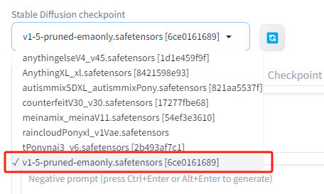
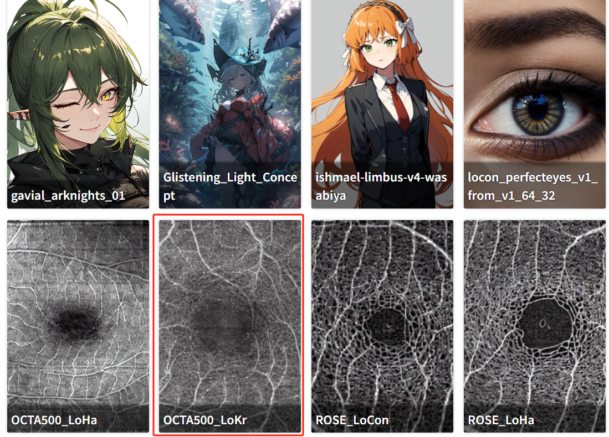
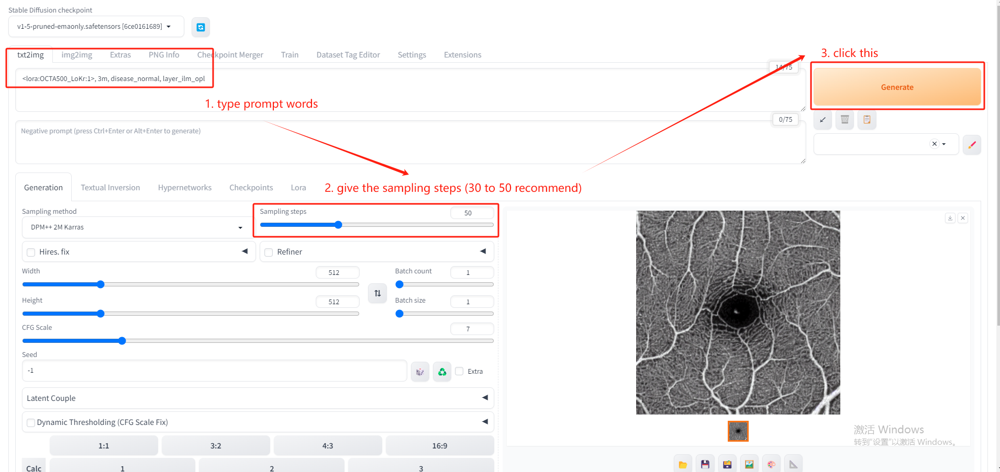
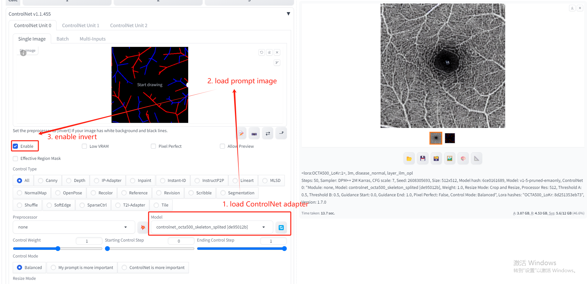
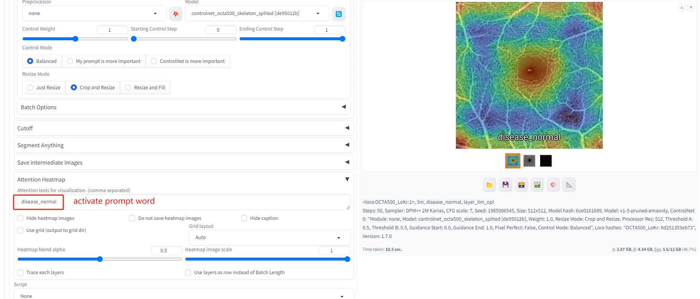

# CAVE-OCTA: A Vessel Expressions Controlled Diffusion Framework for Synthetic OCTA Image Generation

## 1. Overview

This project involves fine-tuning Diffusion using LyCORIS framework on OCTA images, built with **PyTorch**.

The base model is stable diffusion 1.5, and the weights is available at: https://civitai.com/models/62437/v1-5-pruned-emaonly

Use **train_controlnet.py** to start controlnet fine-tuning. The warning informations will tell you which packages you should install. These packages are commonly used Python libraries without additional configuration. 

    python train_controlnet.py

The LoCon, LoHa and LoKr implementation is at: https://github.com/KohakuBlueleaf/LyCORIS

The dataset should contains three elements: source images, prompt images, and prompt words. The paths and discriptions should be recorded at a JSON file like this (the dicts of samples in a big list):

    [
        {
            "target": "3M/OCTA(FULL)/10301.bmp",
            "source": "prompts/boundary/3M/splited/10301.png",
            "prompt": ""
        },
        {
            "target": "3M/OCTA(FULL)/10302.bmp",
            "source": "prompts/boundary/3M/splited/10302.png",
            "prompt": ""
        }
        ...
    ]

If you want to use this dataset, pass the path of this JSON file to the initialization parameters of ControlNet_Trainer class in **train_controlnet.py**.

The datasets adopted in this research are **OCTA-500** and **ROSE**.

**OCTA-500**'s related paper: https://arxiv.org/abs/2012.07261

**ROSE**'s related paper: https://arxiv.org/abs/2007.05201

If you need to visualize the prediction samples after fine-tuning, the WebUI tool which can be acquired at: https://github.com/AUTOMATIC1111/stable-diffusion-webui

The CAVE-OCTA is trigger by a style adapter and a optional control-net, you can load these component weights through the following steps:

### 1. Select the base model:

### 2. Load style adapter: 

### 3. Load ControlNet adapter (Optional): 

## 2. Samples of ControlNet Adapter Effect

## 3. Others

### 1. Tools

#### DAAM

Related paper: https://arxiv.org/abs/2210.04885

You can use DAAM tool to get attention heatmap of the prompt words.

#### MONAI

**train_segmentation.py** uses MONAI library performed retinal vessels' segmentation, just for referance now.

#### Prompt Images Producer

**make_prompt_images.py** can produce the prompt images of boudary, certerline, and skeleton.

### 2. Notes

The paper corresponding to this repository is currently under review, and more details will be disclosed after the paper is accepted.